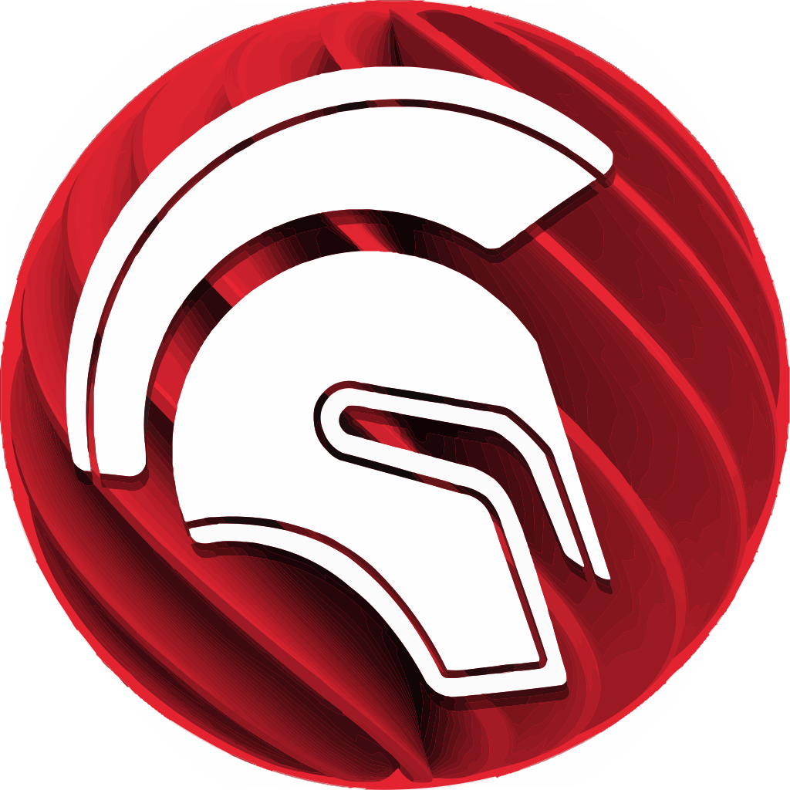
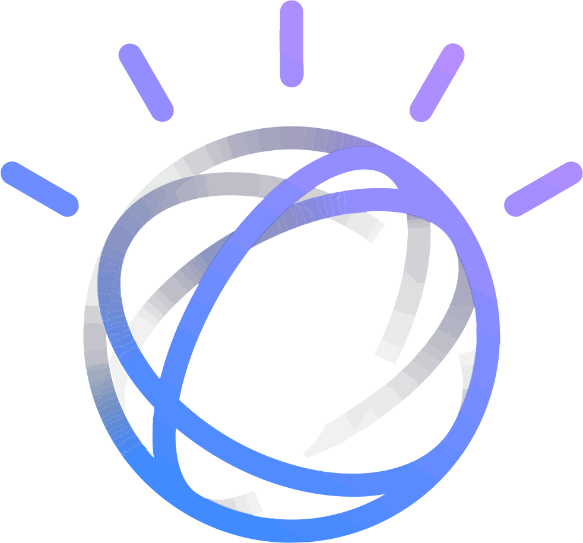
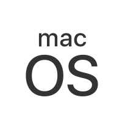
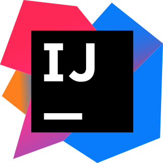
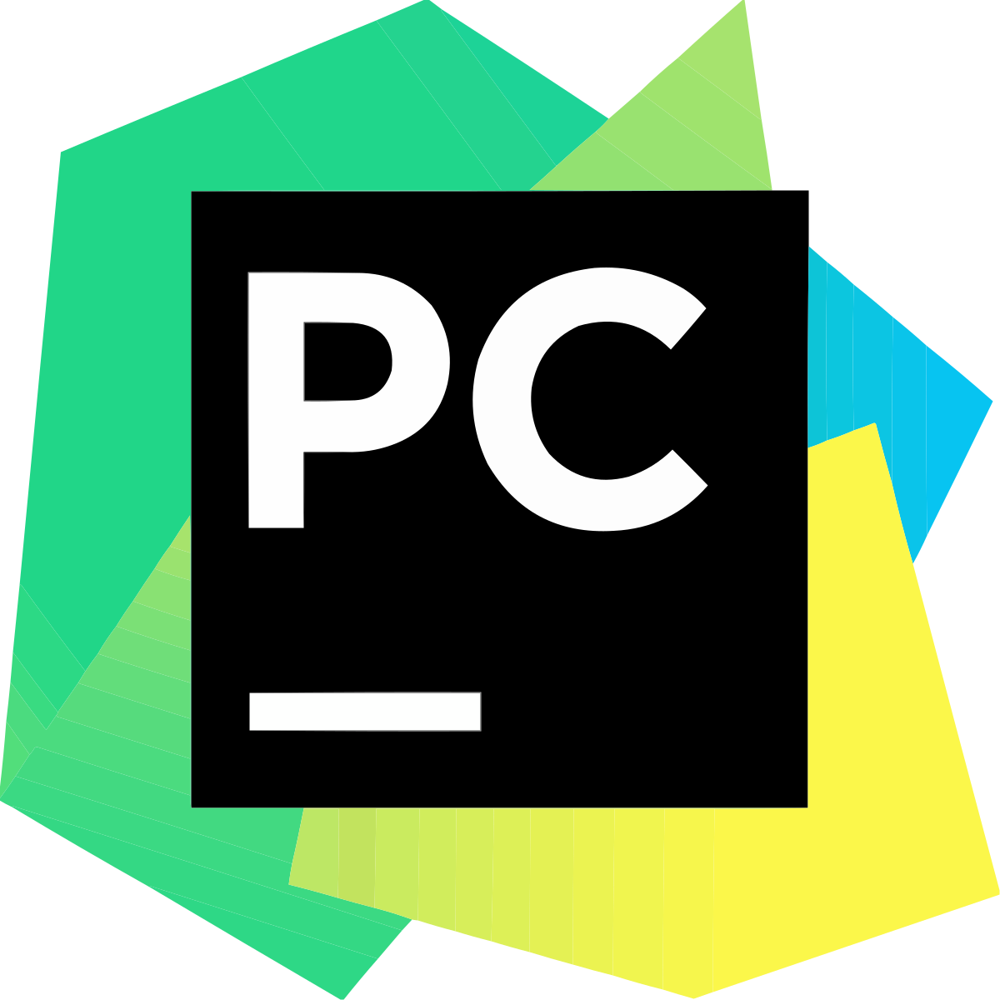
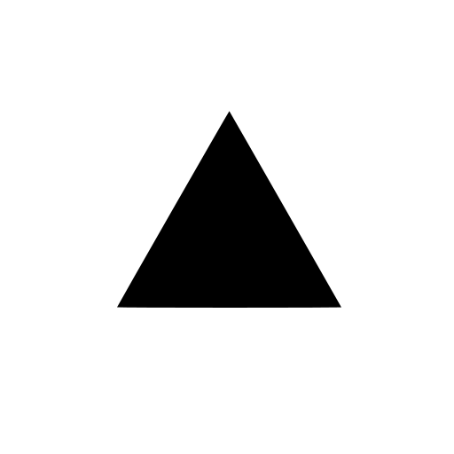

# Contact/Social Network

    
    

  

# Skills

### Programming language

    
    
    
    
    
    
     
    
    
    
    
    
    

### Cloud

    
    

 

### Frameworks

    
    
    
    
    
    
    
    
     
    
    
    
    
    
    
    
    

 

### Relational Database

    

 
    
### IA/ChatBot

    

 

### IOT

    
    

 

### Robotics

    

 

### Operational System

    
    
    
    
    

 

### Terminal

    
    
    
    

 

### IDEs

    
    
    
    
    
    
    
    
    
     
    
    
    
    
    
    
    
    

 

### Services

    
    
    
    

 

### Container

    

 

### Softwares

    

  

### Design

    
    
    
    
    
    
    
    

 

### Project management

    
    
    
    

 

### Office

    
    
    

