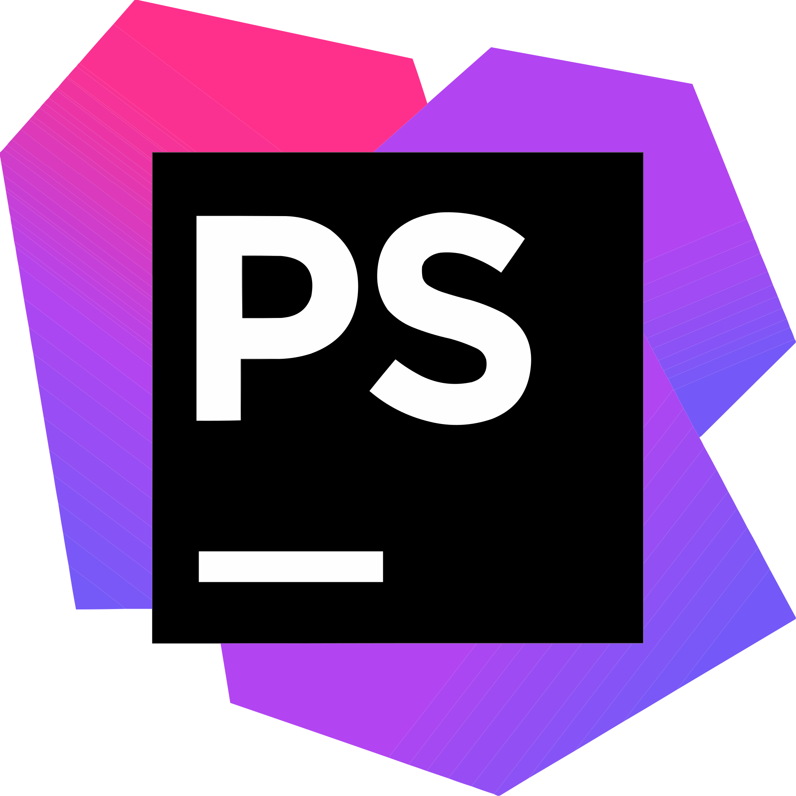

# Contato

    
    

  

# Skills
### Linguagens

    
    
    
    
    
    
    
    
    
    
    

 

### Frameworks

    
    
    
    
    
    
    
    
    
    
    

 

### DataBases

    
    
    
    
    

 
    
### IA/ChatBot

    

 

### IOT

    
    

 

### Robótica

    

 

### Terminal

    
    
    

 

### IDEs

    
    
    
    
    
    
    
    
    
    
    

 

### Hospedagens de código

    
    
    

 

### Softwares

    
    

  

### Design

    
    
    
    
    
    
    

 

### Gestão de projetos

    
    
    
    

 

### Office

    
    

